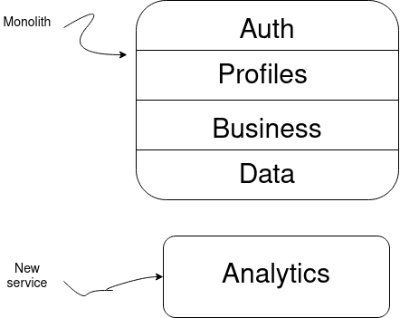

# Monolith break-down
This document is motivated by the _Senior Principal Architech_ exercise.

## General considerations
Moving from a monolith architecture to a micro-services (or services) architecture, is something that you want to approach based on your team size, rather than based on scalating your application. The decision should be made bacause you have team to face it and, of course, you think it is beneficial for the project in general.

The above stated is because this movement is a enormeous challenge, and the mantainance of a micro-services archivtecture is way more expensive than a monolith one. It is in terms of time, tool, costs and other resources.

# Approaching the split
The mindset for building the micro-services architecture will be to think in terms of domain services, rather than technical services. It means, when building our architecture based on services, we describe it in terms of problem domain, we say Payroll, Jobs, Talents, instead of Job DB, or Business.

To move to a micro-services (or services) based architecture, any new feature or service will be created separated from the monolith. The current services from the monolith will be also split, but there will be a period of co-living.

