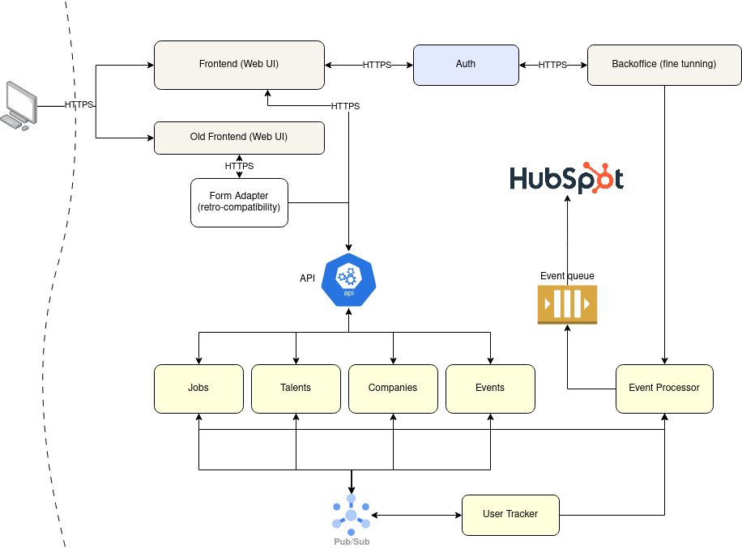

# Monolith break-down
This document is motivated by the _Senior Principal Architech_ exercise.

## General considerations
Moving from a monolith architecture to a micro-services (or services) architecture, is something that you want to approach based on your team size, rather than based on scalating your application. The decision should be made bacause you have team to face it and, of course, you think it is beneficial for the project in general.

The above stated is because this movement is a enormeous challenge, and the mantainance of a micro-services archivtecture is way more expensive than a monolith one. It is in terms of time, tool, costs and other resources.

# Approaching the split
The mindset for building the micro-services architecture will be to think in terms of domain services, rather than technical services. It means, when building our architecture based on services, we describe it in terms of problem domain, we say Payroll, Jobs, Talents, instead of Job DB, or Business.

To move to a micro-services (or services) based architecture, any new feature or service will be created separated from the monolith. The current services from the monolith will be also split, but there will be a period of co-living.

To start the split, we should start by migrating a few special services that will run in parallel and will start to receiving moderated traffic by the time we understand they are in good shape. These candidates might be: Jobs, Talents and Companies. Since they can be encapsulated and can mantain an unique source of truth each. They we can add a flag to our monolith to route to comsume these services.

## High level architecture
The diagram below describes the high level architecture.

Module description:
- Frontend: Web Service facing the client. Candidate tech stack: Node.js, React.
- Old Frontend:Old Web Service facing the client.
- Form Adapter: A rquest translator from from format to API. Candidate tech stack: Node.js or Python.
- API: An SLA for the current API. Candidate tech stack: Node.js or Python.
- Jobs: Service that gatekeeps the jobs. Candidate tech stack: Node.js or Python.
- Talents: Service that gatekeeps the talents. Candidate tech stack: Node.js or Python.
- Companies: Service that gatekeeps the companies. Candidate tech stack: Node.js or Python.
- Events: Service that gatekeeps the events. Candidate tech stack: Node.js or Python.
- Event Processor: This module is in charge of detecting and processing events, like job closure, match suggestion. Also a candidate for ML exploring. Candidate tech stack: C++, Rust, Go, Python.
- User Tracker: This module is in charge of keep and track user information, like location, usage, etc. Candidate tech stack: Python, Node.js.
- Event Queue: A queue to hold the processes events waiting to be consumed by HubSpot. Candidate tech stack: SQS or other cloud provided.
- Pub/Sub: Pub/sub system to for updating information. Candidate tech stack: Kafka, Amazon MQ, or other cloud based service.

# Further considerations
- Monitoring
